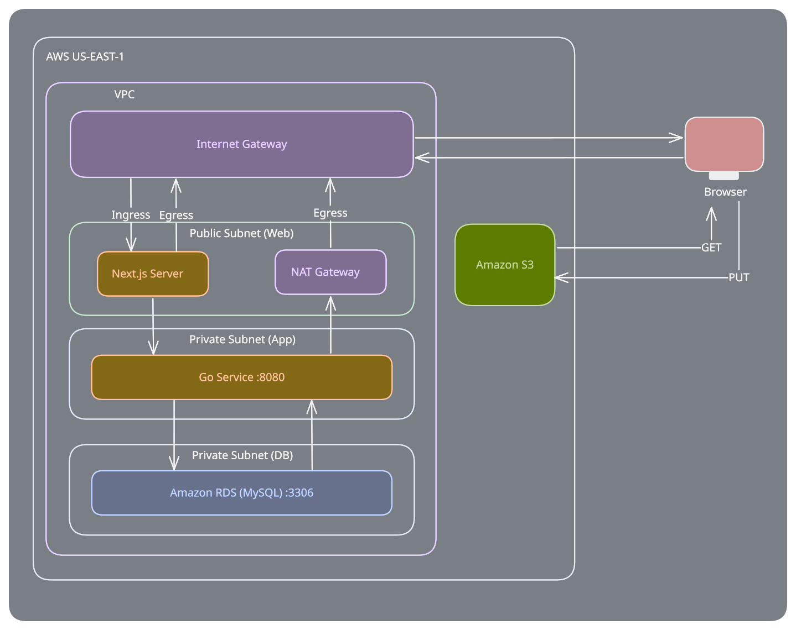

# Tiered AWS Demo

A small three-tier photo log: write down where you went, attach a photo, edit or
delete entries, and filter by location. Built as an AWS demo, so the tiers are
split the way they would be in a VPC.

- **Web tier** - Next.js (App Router), public subnet. Server Components and
  Server Actions.
- **App tier** - Go, standard library `net/http`, **private subnet, no public
  ingress**.
- **Data tier** - MySQL, private subnet. One `entries` table.
- **Photos** - Amazon S3, uploaded straight from the browser with presigned URLs.

```
backend/     Go service (app tier)
frontend/    Next.js app (web tier)
database/    schema.sql
```

## How the tiers talk



The browser never addresses the Go service. Three things enforce that:

1. **`lib/api.ts` is marked `server-only`.** If a client component ever imports
   it, `next build` fails instead of shipping the service URL to the browser.
2. **`API_URL` has no `NEXT_PUBLIC_` prefix**, so Next.js will not inline it into
   client JavaScript.
3. **The Go service has no CORS middleware.** It has no origins to allow,
   because no browser is supposed to reach it.

Photos are the one thing that does not go through the Go service. The browser
asks a Server Action for a presigned URL, the action asks the Go service, and
then the browser PUTs the file **straight to S3**. S3 is a public endpoint by
design, and this keeps image bytes off both servers.

## Prerequisites

- Go 1.25 or newer (required by the AWS SDK; the router also relies on the
  `GET /path/{id}` route patterns added in Go 1.22)
- Node.js 20 or newer, plus npm
- A running MySQL 8 server
- An AWS account with an S3 bucket, and credentials available locally

## 1. Create the database

The Go service runs `CREATE TABLE IF NOT EXISTS` on startup, so you only need
the database itself.

```bash
mysql -u root -p -e "CREATE DATABASE IF NOT EXISTS travel_journal"
```

To create the table by hand instead, apply the schema:

```bash
mysql -u root -p travel_journal < database/schema.sql
```

## 2. Create the S3 bucket

This uses the AWS Console instead of the CLI.
1. Sign in to the [AWS Console](https://console.aws.amazon.com/s3/) and open
   **S3**.
2. Click **Create bucket**.
3. Enter a **Bucket name** (must be globally unique — e.g.
   `my-travel-journal-bucket-<yourname>`), and pick an **AWS Region** (e.g.
   `us-east-1`). Note the region you chose — you'll need it for `AWS_REGION`
   in step 3.
4. Under **Block Public Access settings for this bucket**, uncheck **Block
   all public access**, then check the acknowledgement box that appears. The
   bucket needs a scoped public-read policy for photos to load in ``
   tags, and the block would override it.
5. Leave everything else at its default and click **Create bucket**.

The bucket needs two more things, both configured from its **Permissions** tab:

**a. CORS, so the browser is allowed to PUT the file.** Open the bucket →
**Permissions** → scroll to **Cross-origin resource sharing (CORS)** → **Edit**,
and paste:

```json
[
    {
        "AllowedHeaders": [
            "*"
        ],
        "AllowedMethods": [
            "PUT",
            "GET"
        ],
        "AllowedOrigins": [
            "*"
        ],
        "ExposeHeaders": [
            "ETag"
        ]
    }
]
```

Click **Save changes**.

**b. Public read access, so the photos load in the `` tags.** Still on
the **Permissions** tab, scroll to **Bucket policy** → **Edit**, and paste
(replace `my-travel-journal-bucket` with your bucket's name):

```json
{
  "Version": "2012-10-17",
  "Statement": [
    {
      "Sid": "PublicReadForPhotos",
      "Effect": "Allow",
      "Principal": "*",
      "Action": "s3:GetObject",
      "Resource": "arn:aws:s3:::my-travel-journal-bucket/uploads/*"
    }
  ]
}
```

Click **Save changes**.

> This makes every uploaded photo readable by anyone with the URL. That is the
> simplest thing that works for a demo — don't do it with photos you care about.

Finally, make sure AWS credentials are available. Either run `aws configure`, or
export them:

```bash
export AWS_ACCESS_KEY_ID=...
export AWS_SECRET_ACCESS_KEY=...
```

The service reads credentials through the AWS SDK's default credential chain. In
AWS it should use an instance role or task role instead, and no keys at all.

## 3. Run the Go service (app tier)

```bash
cd backend
cp .env.example .env
```

Edit `.env` and set at least `S3_BUCKET` and `AWS_REGION` — the service refuses
to start without them. The `DB_*` values already default to a stock local MySQL.

```bash
go run .
```

You should see:

```
travel journal api listening on http://localhost:8080
```

Check it:

```bash
curl http://localhost:8080/health
```

```json
{"status":"ok"}
```

> If port 8080 is already in use, set `PORT=8081` in `backend/.env` and match it
> in `frontend/.env` below.

### API reference

Reachable only from the web tier.

| Method   | Path                    | Notes                                        |
| -------- | ----------------------- | -------------------------------------------- |
| `GET`    | `/health`               | Liveness check — point your load balancer here |
| `GET`    | `/api/entries`          | Newest `entry_date` first; `?location=` filters on an exact match |
| `GET`    | `/api/entries/{id}`     | One entry                                     |
| `POST`   | `/api/entries`          | Create; returns 201                           |
| `PUT`    | `/api/entries/{id}`     | Update                                        |
| `DELETE` | `/api/entries/{id}`     | Delete                                        |
| `POST`   | `/api/uploads/presign`  | Returns `{ uploadUrl, fileUrl }`              |

`title` and `entry_date` (`YYYY-MM-DD`) are required; `location`, `note` and
`image_url` are optional. Errors come back as `{ "error": "message" }`.

## 4. Run the Next.js app (web tier)

In a second terminal:

```bash
cd frontend
cp .env.example .env
npm install
npm run dev
```

`API_URL` defaults to `http://localhost:8080`, so you only need to edit `.env` if
the Go service moved.

Open <http://localhost:3000>.

## 5. Confirm it works

With no entries yet, the **Add an entry** form is already expanded. Then:

* **Add:** Create entries with a title, location, date, and an uploaded photo.
* **Filter:** View entries by a specific location or view all.
* **Edit:** Modify an existing entry's details or replace its photo.
* **Delete:** Remove an entry (requires confirmation).

To verify photos landed in S3, go to the S3 console and view the objects in the bucket.

## Deploying on AWS

The shape this is written for:

| Tier     | Placement                        | Notes                                        |
| -------- | -------------------------------- | -------------------------------------------- |
| Next.js  | Public subnets, behind an ALB    | `npm run build` emits `.next/standalone`      |
| Go       | Private subnets, internal ALB or service discovery | Set `API_URL` to its internal DNS name |
| MySQL    | Private subnets (RDS)            | Set the `DB_*` vars                           |
| S3       | Regional endpoint                | Bucket policy as in step 2                    |

Security groups do the actual enforcing: the Go tasks should accept traffic only
from the Next.js security group, and RDS only from the Go security group. Give
the Go tier a task/instance role with `s3:PutObject` on
`arn:aws:s3:::<bucket>/uploads/*` so it can sign uploads without any static keys.
