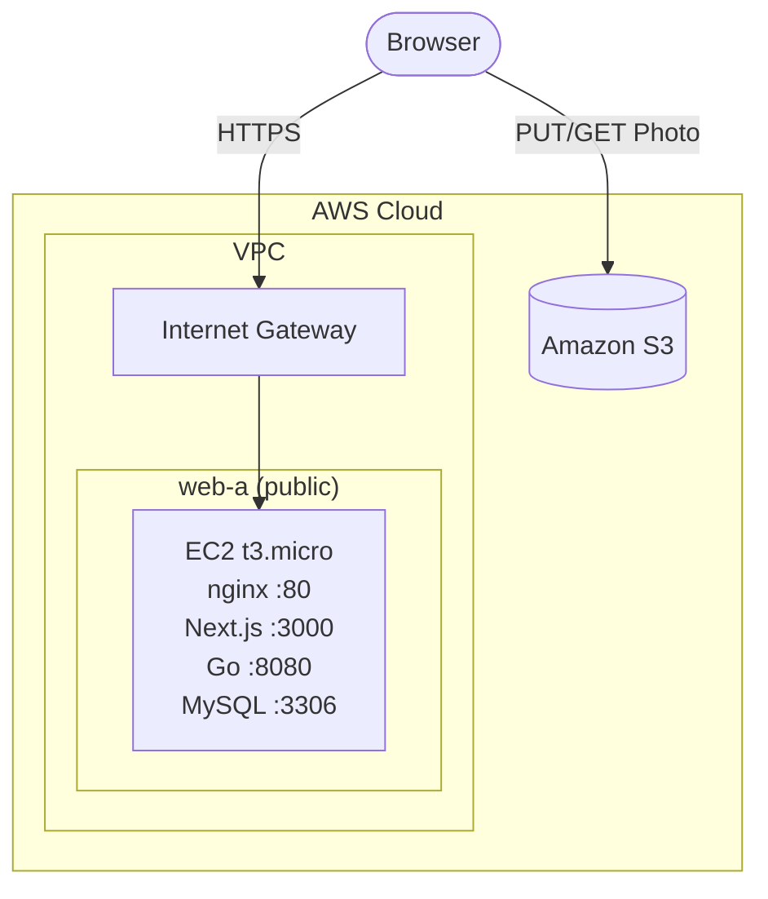

# Stage 1 — Everything on one EC2 instance

The least-ideal, most-beginner-friendly version of the architecture: one EC2
instance in a public subnet runs nginx, the Next.js web tier, the Go app
tier, and a local MySQL database, all at once.



Repo: <https://github.com/hasathcharu/aws-demo>

We connect to the instance with **AWS Systems Manager (SSM) Session
Manager** instead of SSH — no `.pem` file to manage, no key pair to launch
with, and no inbound port 22 at all. The instance reaches out to SSM over
outbound HTTPS, so all you need is a **Connect** button in the console (or
`aws ssm start-session` from the CLI).

## Prerequisites

- An AWS account.
- An S3 bucket already created with CORS + the public-read policy, as
  described in the main README's "Create the S3 bucket" section. You'll pass
  its name in as a parameter — none of these stages create or delete it.
- Your IAM user needs the `ssm:StartSession` permission to open a Session
  Manager session against the instance — this is already included in
  `AdministratorAccess` and `PowerUserAccess`, so most accounts need no
  extra setup.

## Deployment steps

### 0. Enable Default Host Management Configuration

1. Sign in as an IAM user with administrative access (not the root user).
2. Console → **Systems Manager** → **Fleet Manager** → **Account management** → **Default Host Management Configuration**.
3. Enable it, letting AWS create the default IAM role it suggests.

This covers Session Manager access for every instance in the
account/Region, so the role in step 3 only needs the S3 inline policy.

### 1. Network

Subnets are named `<tier>-<az>` throughout the workshop — `web-a` is the web
tier in AZ `a`. Stages 2 and 3 add `app-a` and `db-a`/`db-b` the same way.

1. Console → **VPC** → create a VPC (e.g. `10.0.0.0/16`).
2. Create and attach an **Internet Gateway** to the VPC.
3. Create one public subnet named `web-a` (e.g. `10.0.0.0/24`) in `us-east-1a`.
4. Create a route table for `web-a`, and associate it to the subnet.
5. In that route table, add a route `0.0.0.0/0` → the Internet Gateway.
6. In subnet settings, confirm **Auto-assign public IPv4** is enabled on `web-a`.

### 2. Security group (for the instance)

Create a security group in that VPC, `stage1-sg`, allowing inbound:

| Port | Source    | Why                          |
| ---- | --------- | ----------------------------- |
| 80   | 0.0.0.0/0 | nginx (public entry point)   |

No inbound rule for port 22 or 3000 is needed. Session Manager works
entirely through the instance's outbound HTTPS connection to the SSM
service, and nginx is the only thing the public should be able to reach —
Next.js (3000) and the Go service (8080) stay behind it on `localhost`.

### 3. IAM role

Create an IAM role for EC2 named `TravelWebInstanceRole` with one inline
policy, so the Go service can presign S3 uploads without static keys:

```json
{
  "Version": "2012-10-17",
  "Statement": [
    {
      "Effect": "Allow",
      "Action": "s3:PutObject",
      "Resource": "arn:aws:s3:::YOUR_BUCKET_NAME/uploads/*"
    }
  ]
}
```

### 4. Launch the instance

1. AMI: Amazon Linux 2023.
2. Instance type: `t3.micro`.
3. Key pair: **Proceed without a key pair** — Session Manager doesn't need one.
4. Network settings: choose your VPC and `web-a` subnet, with **Auto-assign public IP** enabled.
5. Security group: `stage1-sg`.
6. Advanced details → IAM instance profile: the role from step 3.

### 5. Connect and install everything

Console → **EC2** → **Instances** → select the instance → **Connect** →
**Session Manager** tab → **Connect**. This opens a terminal in the browser
as `ssm-user`, no key or client needed. (Give the instance a minute or two
after launch to register with Systems Manager before it shows up as
connectable.)

First navigate to the user's home directory.

```bash
cd
```

```bash
# Node.js 20, plus nginx for the reverse proxy
curl -fsSL https://rpm.nodesource.com/setup_20.x | sudo bash -
sudo dnf install -y nodejs git mariadb105-server nginx

# Go 1.25 (not in the package repos — install the official tarball)
curl -LO https://go.dev/dl/go1.25.0.linux-amd64.tar.gz
sudo tar -C /usr/local -xzf go1.25.0.linux-amd64.tar.gz
echo 'export PATH=$PATH:/usr/local/go/bin' | sudo tee /etc/profile.d/go.sh
source /etc/profile.d/go.sh

# MySQL
sudo systemctl enable --now mariadb
sudo mysql -e "CREATE DATABASE IF NOT EXISTS travel_journal;"
sudo mysql -e "ALTER USER 'root'@'localhost' IDENTIFIED VIA mysql_native_password USING PASSWORD('Test123'); FLUSH PRIVILEGES;"
```

### 6. Clone and configure

```bash
git clone https://github.com/hasathcharu/aws-demo.git
cd aws-demo
```

Backend:

```bash
cd backend
cp .env.example .env
```

Edit `.env`:

```
S3_BUCKET=YOUR_BUCKET_NAME
AWS_REGION=us-east-1
PORT=8080
```

(`DB_*` values already default to a stock local MySQL — no edit needed.)

Add swap space

```bash
sudo fallocate -l 2G /swapfile
sudo chmod 600 /swapfile
sudo mkswap /swapfile
sudo swapon /swapfile
echo '/swapfile none swap sw 0 0' | sudo tee -a /etc/fstab
```

```bash
/usr/local/go/bin/go build -o /home/ssm-user/aws-demo/backend/app .
```

Frontend:

```bash
cd ../frontend
cp .env.example .env
```

`API_URL` already defaults to `http://localhost:8080`, which is correct here.

```bash
npm install
NODE_OPTIONS="--max-old-space-size=1536" npm run build
```

### 7. Configure nginx as a reverse proxy

Next.js stays bound to `127.0.0.1:3000` — nginx is the only thing listening
on the interface reachable from the internet, on port 80.

Amazon Linux 2023's nginx ships with one default `server {}` block already
listening on port 80 (in `/etc/nginx/nginx.conf`). Rather than adding a
second one in `conf.d/` (which ends up fighting the default block for the
same port and `server_name`), edit that block directly to proxy to the app:

```bash
sudo cp /etc/nginx/nginx.conf /etc/nginx/nginx.conf.bak
sudo tee /etc/nginx/nginx.conf > /dev/null << 'EOF'
user nginx;
worker_processes auto;
error_log /var/log/nginx/error.log notice;
pid /run/nginx.pid;

include /usr/share/nginx/modules/*.conf;

events {
    worker_connections 1024;
}

http {
    log_format  main  '$remote_addr - $remote_user [$time_local] "$request" '
                      '$status $body_bytes_sent "$http_referer" '
                      '"$http_user_agent" "$http_x_forwarded_for"';

    access_log  /var/log/nginx/access.log  main;

    sendfile            on;
    tcp_nopush          on;
    keepalive_timeout   65;
    types_hash_max_size 4096;

    include             /etc/nginx/mime.types;
    default_type        application/octet-stream;

    include /etc/nginx/conf.d/*.conf;

    server {
        listen       80;
        listen       [::]:80;
        server_name  _;

        location / {
            proxy_pass http://127.0.0.1:3000;
            proxy_http_version 1.1;
            proxy_set_header Upgrade $http_upgrade;
            proxy_set_header Connection 'upgrade';
            proxy_set_header Host $host;
            proxy_set_header X-Real-IP $remote_addr;
            proxy_set_header X-Forwarded-For $proxy_add_x_forwarded_for;
            proxy_set_header X-Forwarded-Proto $scheme;
            proxy_cache_bypass $http_upgrade;
        }
    }
}
EOF
```

Then test and start:

```bash
sudo nginx -t
sudo systemctl enable --now nginx
```

### 8. Run both as systemd services

```bash
sudo tee /etc/systemd/system/travel-backend.service > /dev/null << 'EOF'
[Unit]
Description=Travel journal backend
After=network.target mariadb.service

[Service]
WorkingDirectory=/home/ssm-user/aws-demo/backend
ExecStart=/home/ssm-user/aws-demo/backend/app
Restart=on-failure
User=ssm-user
EnvironmentFile=/home/ssm-user/aws-demo/backend/.env

[Install]
WantedBy=multi-user.target
EOF
```

```bash
sudo tee /etc/systemd/system/travel-frontend.service > /dev/null << 'EOF'
[Unit]
Description=Travel journal frontend
After=network.target travel-backend.service

[Service]
WorkingDirectory=/home/ssm-user/aws-demo/frontend
ExecStart=/usr/bin/npm run start
Restart=on-failure
User=ssm-user
EnvironmentFile=/home/ssm-user/aws-demo/frontend/.env

[Install]
WantedBy=multi-user.target
EOF
```

```bash
sudo systemctl daemon-reload
sudo systemctl enable --now travel-backend travel-frontend
```

### 9. Verify

```bash
curl http://localhost:8080/health   # {"status":"ok"}
curl -I http://localhost            # 200, proxied through nginx
```

Open `http://<public-ip>` in a browser and add an
entry with a photo.

## Teardown

### If continuing to Stage 2

Stage 2 reuses this VPC and the `web-a` subnet directly, so leave the
network in place and only clean up what's specific to this stage's
instance:

1. Terminate the EC2 instance.

### Complete teardown

Do this if you're done with the workshop, or want to start over from
scratch:

1. Terminate the EC2 instance.
2. Delete the `TravelWebInstanceRole` IAM role (the one with the S3
   inline policy).
3. Delete the instance's security group.
4. Delete the VPC (Console → **VPC** → select it → **Delete VPC**). This
   one action also cleans up its subnet, route table, and Internet
   Gateway — no need to detach or delete those individually first.
5. Leave the S3 bucket — it's shared across all three stages.
