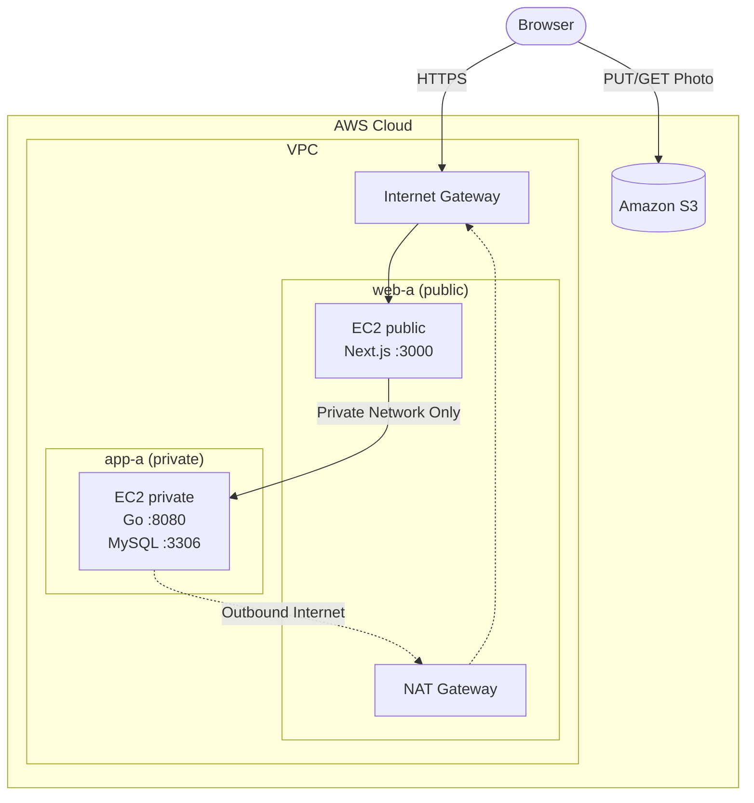

# Stage 2 — Public/private split with a NAT Gateway

Two EC2 instances now. The public one only runs the Next.js web tier. The
private one (no public IP) runs the Go app tier and MySQL, reachable only
from the public instance. A NAT Gateway gives the private instance outbound
internet access (needed to reach S3 for presigning, package installs, etc.)
without exposing it to inbound traffic.



Repo: <https://github.com/hasathcharu/aws-demo>

We connect to both instances with **AWS Systems Manager (SSM) Session
Manager** — no SSH keys, no bastion, and no jump-host / agent forwarding
through the public instance. The private instance reaches Session Manager
over the internet through the NAT Gateway's outbound path (the same route
it already needs for S3 and package installs).

## Prerequisites

- Same S3 bucket from Stage 1 (with CORS + public-read policy already set).
- Your IAM user needs the `ssm:StartSession` permission (included in
  `AdministratorAccess`/`PowerUserAccess`).
- If you built Stage 1 manually, use its **"If continuing to Stage 2"**
  teardown option (not the complete one) — it keeps the VPC and the subnet `web-a`,
  which this stage builds on, while clearing out Stage 1's instance-
  specific resources.

## Deployment steps

### 0. Enable Default Host Management Configuration

Skip this if you already enabled it for Stage 1 — it's an account/Region-wide
setting, not tied to any one instance.

1. Sign in as an IAM user with administrative access (not the root user).
2. Console → **Systems Manager** → **Fleet Manager** → **Account management** → **Default Host Management Configuration**.
3. Enable it, letting AWS create the default IAM role it suggests.

### 1. Network

1. In your VPC, add a **second subnet** named `app-a` (e.g. `10.0.1.0/24`) in
   the same AZ as `web-a` — this is the private app-tier subnet. Do **not**
   enable auto-assign public IPv4 on it.
2. Create a regional **NAT Gateway** in `web-a` (**Public** connectivity type). Use
   the **Allocate Elastic IP** button in the same creation wizard rather
   than allocating one beforehand — it provisions and attaches the EIP for
   you in one step.
3. Create a new route table for `app-a` subnet, with a route `0.0.0.0/0` → the NAT
   Gateway, and associate it with `app-a`.

### 2. Security groups (for the instances)

`stage2-public-sg` (attach to the public instance):

| Port | Source    | Why                          |
| ---- | --------- | ----------------------------- |
| 80   | 0.0.0.0/0 | nginx (public entry point)   |

`stage2-private-sg` (attach to the private instance):

| Port | Source              | Why                            |
| ---- | ------------------- | ------------------------------- |
| 8080 | `stage2-public-sg`   | Go service, called by Next.js |

No inbound rule for port 22, or for 3000 on the public instance —
Session Manager works entirely through each instance's outbound
connection, and nginx (below) is the only thing the public should be able
to reach on the public instance; Next.js (3000) stays behind it on
`localhost`.

### 3. IAM role

Same inline policy as Stage 1 (`s3:PutObject` on
`arn:aws:s3:::YOUR_BUCKET/uploads/*`), but this time attach the instance
profile only to the **private** instance — that's where the Go service runs.

### 4. Launch both instances

1. Launch the **private** instance first: `t3.micro`, `app-a`, no
   public IP, `stage2-private-sg`, the IAM instance profile, **proceed
   without a key pair**.
2. Note its **private IP** (you'll need it for the frontend's `.env`).
3. Launch the **public** instance: `t3.micro`, `web-a`,
   `stage2-public-sg`, no IAM role needed, also no key pair.

### 5. Set up the private instance (Go + MySQL)

Console → **EC2** → select the **private** instance → **Connect** →
**Session Manager** tab → **Connect**. This opens a terminal in the
browser directly on the private instance, as `ssm-user` — no bastion, no
forwarding.

First navigate to the user's home directory.

```bash
cd
```

```bash
sudo dnf install -y git mariadb105-server
curl -LO https://go.dev/dl/go1.25.0.linux-amd64.tar.gz
sudo tar -C /usr/local -xzf go1.25.0.linux-amd64.tar.gz
echo 'export PATH=$PATH:/usr/local/go/bin' | sudo tee /etc/profile.d/go.sh
source /etc/profile.d/go.sh

sudo systemctl enable --now mariadb
sudo mysql -e "CREATE DATABASE IF NOT EXISTS travel_journal;"
sudo mysql -e "ALTER USER 'root'@'localhost' IDENTIFIED VIA mysql_native_password USING PASSWORD('Test123'); FLUSH PRIVILEGES;"

git clone https://github.com/hasathcharu/aws-demo.git
cd aws-demo/backend
cp .env.example .env
```

Edit `.env`:

```
S3_BUCKET=YOUR_BUCKET_NAME
AWS_REGION=us-east-1
PORT=8080
```

(`DB_*` values already default to a stock local MySQL — no edit needed.)

Add swap space

```bash
sudo fallocate -l 2G /swapfile
sudo chmod 600 /swapfile
sudo mkswap /swapfile
sudo swapon /swapfile
echo '/swapfile none swap sw 0 0' | sudo tee -a /etc/fstab
```

```bash
/usr/local/go/bin/go build -o /home/ssm-user/aws-demo/backend/app .
```

The unit file, written the same way as Stage 1's:

```bash
sudo tee /etc/systemd/system/travel-backend.service > /dev/null << 'EOF'
[Unit]
Description=Travel journal backend
After=network.target mariadb.service

[Service]
WorkingDirectory=/home/ssm-user/aws-demo/backend
ExecStart=/home/ssm-user/aws-demo/backend/app
Restart=on-failure
User=ssm-user
EnvironmentFile=/home/ssm-user/aws-demo/backend/.env

[Install]
WantedBy=multi-user.target
EOF
```

```bash
sudo systemctl daemon-reload
sudo systemctl enable --now travel-backend
sudo systemctl status travel-backend
curl http://localhost:8080/health   # {"status":"ok"}
```

### 6. Set up the public instance (Next.js + nginx)

Console → **EC2** → select the **public** instance → **Connect** →
**Session Manager** tab → **Connect**.

First navigate to the user's home directory.

```bash
cd
```

```bash
curl -fsSL https://rpm.nodesource.com/setup_20.x | sudo bash -
sudo dnf install -y nodejs git nginx

git clone https://github.com/hasathcharu/aws-demo.git
cd aws-demo/frontend
cp .env.example .env
```

Edit `.env` — point it at the **private** instance's private IP:

```
API_URL=http://<private-ip>:8080
```

`t3.micro` only has 1 GiB of RAM, which isn't reliably enough for
`npm run build` on its own — add 2G of swap first, same as Stage 1:

```bash
sudo fallocate -l 2G /swapfile
sudo chmod 600 /swapfile
sudo mkswap /swapfile
sudo swapon /swapfile
echo '/swapfile none swap sw 0 0' | sudo tee -a /etc/fstab
```

```bash
npm install
NODE_OPTIONS="--max-old-space-size=1536" npm run build
```

### 7. Configure nginx as a reverse proxy

Next.js stays bound to `127.0.0.1:3000` — nginx is the only thing listening
on the interface reachable from the internet, on port 80. Same as Stage 1,
edit the default `server {}` block in `/etc/nginx/nginx.conf` in place
rather than adding a second one in `conf.d/`:

```bash
sudo cp /etc/nginx/nginx.conf /etc/nginx/nginx.conf.bak
sudo tee /etc/nginx/nginx.conf > /dev/null << 'EOF'
user nginx;
worker_processes auto;
error_log /var/log/nginx/error.log notice;
pid /run/nginx.pid;

include /usr/share/nginx/modules/*.conf;

events {
    worker_connections 1024;
}

http {
    log_format  main  '$remote_addr - $remote_user [$time_local] "$request" '
                      '$status $body_bytes_sent "$http_referer" '
                      '"$http_user_agent" "$http_x_forwarded_for"';

    access_log  /var/log/nginx/access.log  main;

    sendfile            on;
    tcp_nopush          on;
    keepalive_timeout   65;
    types_hash_max_size 4096;

    include             /etc/nginx/mime.types;
    default_type        application/octet-stream;

    include /etc/nginx/conf.d/*.conf;

    server {
        listen       80;
        listen       [::]:80;
        server_name  _;

        location / {
            proxy_pass http://127.0.0.1:3000;
            proxy_http_version 1.1;
            proxy_set_header Upgrade $http_upgrade;
            proxy_set_header Connection 'upgrade';
            proxy_set_header Host $host;
            proxy_set_header X-Real-IP $remote_addr;
            proxy_set_header X-Forwarded-For $proxy_add_x_forwarded_for;
            proxy_set_header X-Forwarded-Proto $scheme;
            proxy_cache_bypass $http_upgrade;
        }
    }
}
EOF
```

```bash
sudo nginx -t
sudo systemctl enable --now nginx
```

### 8. Run the frontend as a systemd service

```bash
sudo tee /etc/systemd/system/travel-frontend.service > /dev/null << 'EOF'
[Unit]
Description=Travel journal frontend
After=network.target

[Service]
WorkingDirectory=/home/ssm-user/aws-demo/frontend
ExecStart=/usr/bin/npm run start
Restart=on-failure
User=ssm-user
EnvironmentFile=/home/ssm-user/aws-demo/frontend/.env

[Install]
WantedBy=multi-user.target
EOF
```

```bash
sudo systemctl daemon-reload
sudo systemctl enable --now travel-frontend
sudo systemctl status travel-frontend
```

### 9. Verify

```bash
curl -I http://localhost            # 200, proxied through nginx
```

Open `http://<public-ip>`. Add an entry with a photo. In the browser's
devtools Network tab, confirm no request ever goes to the private IP or port
8080 directly from the browser — only the Next.js server talks to it.

## Teardown

### If continuing to Stage 3

Stage 3 moves the database onto RDS. So we will have to recreate the private instance anyway.

1. Terminate the **private** (backend) EC2 instance.

Leave everything else in place: the public instance, `web-a` and `app-a` subnets, the
NAT Gateway, both security groups, and the IAM role. Stage 3 reuses all of
them.

### Complete teardown

1. Terminate both EC2 instances.
2. Delete the IAM instance profile / role / policy.
3. Delete both instance security groups.
4. Delete the NAT Gateway, then release the Elastic IP (NAT Gateway deletion
   takes a few minutes — wait for it before releasing the IP or deleting the
   route table).
5. Delete `app-a`'s route table and its subnet association.
6. Delete `app-a` subnet.
7. Delete `web-a`, the IGW, and the VPC — this also finishes off Stage
   1's network, if you kept it around.
8. Leave the S3 bucket.
