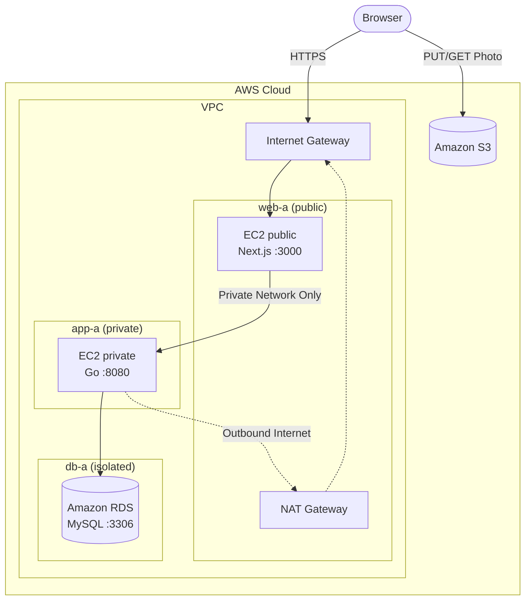

# Stage 3 — RDS instead of an instance database

The final architecture from the main README: Next.js on a public EC2
instance, Go on a private EC2 instance, and MySQL moved off that instance
onto Amazon RDS. The private EC2 instance now only runs the Go service.



Repo: <https://github.com/hasathcharu/aws-demo>

We keep using **AWS Systems Manager (SSM) Session Manager**, the same way
as Stage 2 — no SSH keys anywhere in this stage either.

## Prerequisites

- Same S3 bucket as Stages 1 and 2.
- Your IAM user needs the `ssm:StartSession` permission (included in
  `AdministratorAccess`/`PowerUserAccess`).
- Default Host Management Configuration should already be enabled from
  Stage 1 or 2 (it's an account/Region-wide setting) — if not, see Stage 1's
  step 0.
- Stage 2's teardown has you terminate the **private** instance, since the
  local database lived on it. Everything else from Stage 2 stays put: the
  public instance, `web-a`, `app-a`, the NAT Gateway, both security groups,
  and the IAM role. This stage launches a fresh private instance with no
  MySQL on it.

## Deployment steps

### 1. Network

1. Keep `web-a` and `app-a` from Stage 2.
2. Add `db-a` (e.g. `10.0.2.0/24`) in `us-east-1a` — the same AZ as `app-a`
   — and `db-b` (e.g. `10.0.3.0/24`) in `us-east-1b`. The suffix is the AZ,
   so `db-b` is the only subnet in this workshop outside AZ `a`. It exists
   purely to satisfy the DB subnet group's two-AZ requirement and stays
   empty.
3. Do **not** associate either with `app-a`'s route table. Leave them on the
   VPC's main route table, which carries only the `local` route: RDS needs no
   path to the NAT Gateway, and giving it one would only widen the blast
   radius (and the NAT bill) for nothing.

### 2. DB subnet group and RDS instance

1. Console → **RDS** → **Subnet groups** → create one spanning `db-a` and
   `db-b`.
2. Create a security group `stage3-rds-sg`: inbound **3306** from
   `stage2-private-sg` (the Go instance's security group) only.
3. Console → **RDS** → **Create database**. Choose **Full configuration** as
   the creation method.
4. **Engine options** → MySQL. **Templates** → **Sandbox**. Under
   **Availability and durability**, keep **Single-AZ DB instance**.
5. **Settings** → Keep the default DB instance identifier, and enter master
   username and password as `root` and `Test123` respectively.
7. **Instance configuration** → `db.t3.micro`, under **Burstable classes**.
   **Storage** → 20 GiB gp3, storage autoscaling off.
8. **Connectivity** → your VPC, **Public access: No**, **DB subnet group**:
   the one from step 1, and **Existing VPC security groups**:
   `stage3-rds-sg` (remove `default` if it comes preselected). Then set
   **Availability Zone** explicitly to `us-east-1a` — the AZ holding `app-a`
   and `db-a`.
9. **Additional configuration** → **Initial database name**:
   `travel_journal`, and make sure **Enable automated backup** in unchecked.
11. Wait for it to become **Available**, then copy its **endpoint**.

### 3. Launch the replacement private EC2 instance

Stage 2's private instance went away with its local MariaDB, so launch a new
one — same placement and settings as before, just with nothing to install for
the database this time:

1. `t3.micro`, Amazon Linux 2023, `app-a`, **no** public IP.
2. Security group `stage2-private-sg`, the IAM instance profile from Stage 2,
   and **proceed without a key pair**.
3. Note its **private IP** — it will not match the old one, which is why
   step 4 exists.

Console → **EC2** → select the new **private** instance → **Connect** →
**Session Manager** tab → **Connect** — same as Stage 2, still no keys.

First navigate to the user's home directory.

```bash
cd
```

```bash
sudo dnf install -y git
curl -LO https://go.dev/dl/go1.25.0.linux-amd64.tar.gz
sudo tar -C /usr/local -xzf go1.25.0.linux-amd64.tar.gz
echo 'export PATH=$PATH:/usr/local/go/bin' | sudo tee /etc/profile.d/go.sh
source /etc/profile.d/go.sh

git clone https://github.com/hasathcharu/aws-demo.git
cd aws-demo/backend
cp .env.example .env
```

No `mariadb105-server` in that list — the database is RDS now.

Edit `.env`, replacing the local DB defaults with the RDS endpoint:

```
DB_HOST=<your-rds-endpoint>
DB_PORT=3306
DB_USER=<master-username>
DB_PASSWORD=<master-password>
DB_NAME=travel_journal
S3_BUCKET=YOUR_BUCKET_NAME
AWS_REGION=us-east-1
PORT=8080
```

Add swap space

```bash
sudo fallocate -l 2G /swapfile
sudo chmod 600 /swapfile
sudo mkswap /swapfile
sudo swapon /swapfile
echo '/swapfile none swap sw 0 0' | sudo tee -a /etc/fstab
```

```bash
/usr/local/go/bin/go build -o /home/ssm-user/aws-demo/backend/app .
```

The unit file, same as Stage 2's without the MariaDB ordering:

```bash
sudo tee /etc/systemd/system/travel-backend.service > /dev/null << 'EOF'
[Unit]
Description=Travel journal backend
After=network.target

[Service]
WorkingDirectory=/home/ssm-user/aws-demo/backend
ExecStart=/home/ssm-user/aws-demo/backend/app
Restart=on-failure
User=ssm-user
EnvironmentFile=/home/ssm-user/aws-demo/backend/.env

[Install]
WantedBy=multi-user.target
EOF
```

```bash
sudo systemctl daemon-reload
sudo systemctl enable --now travel-backend
curl http://localhost:8080/health   # {"status":"ok"}
```

### 4. Repoint the public instance

The frontend's `.env` still holds the terminated instance's IP. Connect to the
**public** instance with Session Manager:

```bash
cd /home/ssm-user/aws-demo/frontend
```

Edit `.env` with the new private IP:

```
API_URL=http://<new-private-ip>:8080
```

`API_URL` is read by the Next.js server at runtime, so a restart is enough —
no rebuild needed:

```bash
sudo systemctl restart travel-frontend
```

### 5. Verify

Open `http://<public-ip>`, add an entry with a photo, and confirm it
persists. From the RDS console, you can check **Monitoring** for connection
activity to confirm traffic is actually reaching RDS and not a leftover
local MySQL.

## Teardown

This is the last stage, so there's just one path — it also finishes off
everything carried over from Stages 1 and 2, since those were left standing
to reach this point.

1. Terminate both EC2 instances.
2. Delete the RDS instance (uncheck "create final snapshot" for a demo —
   deletion takes several minutes). On the Sandbox template it bills by the
   hour, so don't leave it running past the session.
3. Delete the DB subnet group.
4. Delete `stage3-rds-sg`, `stage2-private-sg`, `stage2-public-sg` (or
   whatever you named them).
5. Delete the IAM instance profile / role / policy.
6. Delete the NAT Gateway, if you used `Regional`, the associated Elastic IP will be
   automatically released. Else, release them manually.
7. Delete the VPC if you're not continuing further. This will delete the Internet Gateway,
   the subnets, and the route tables along with it.
8. Empty the S3 bucket and delete it.
